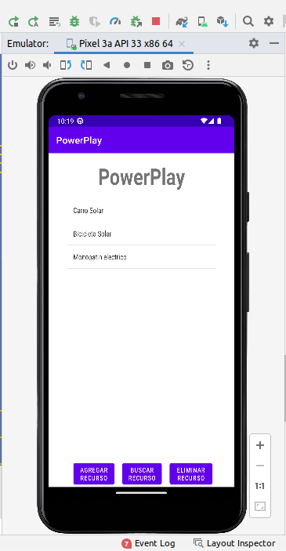
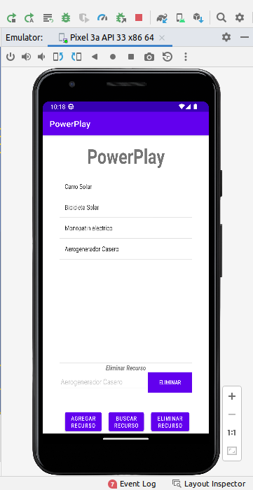
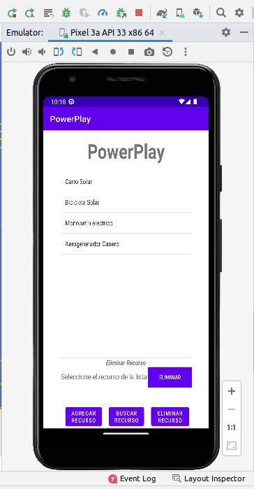
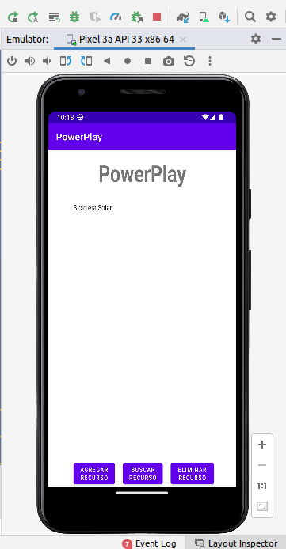
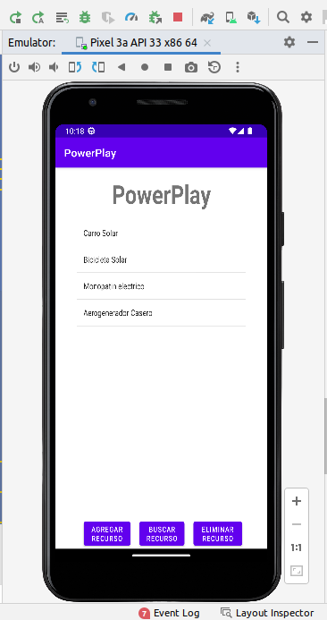
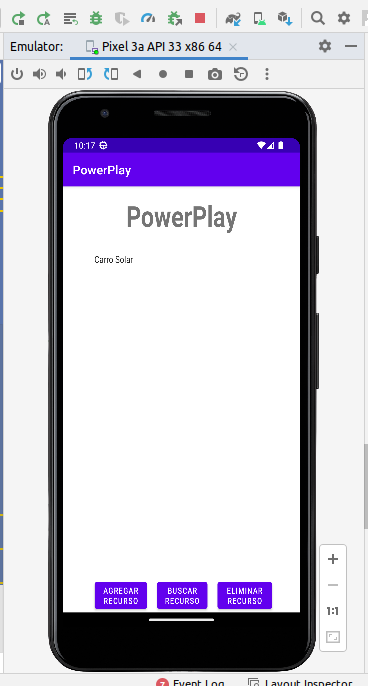
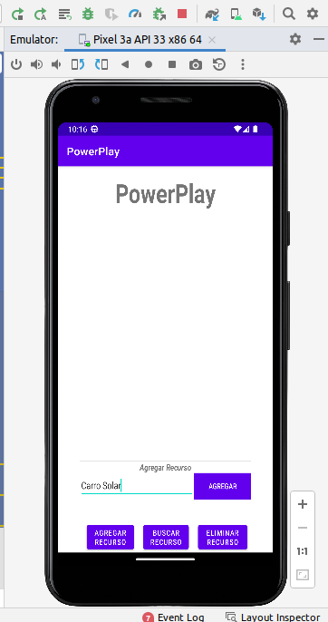
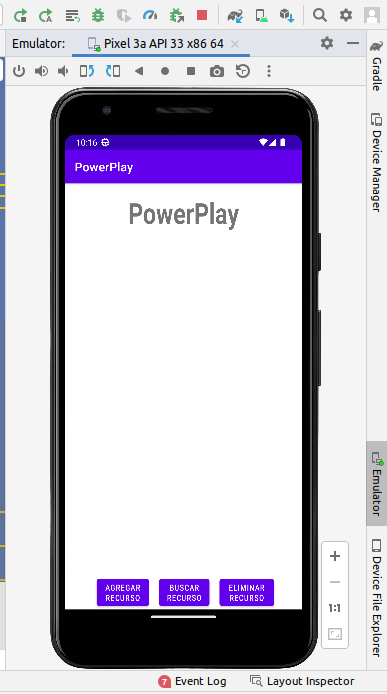

# PowerPlay

¡Presentamos "PowerPlay: Energify" - la aplicación definitiva de gestión de recursos diseñada para revolucionar la transición energética en la vibrante ciudad de Bogotá!

En el mundo actual, donde las prácticas sostenibles y la conciencia ambiental son cruciales, la necesidad de una gestión efectiva de los recursos energéticos nunca ha sido tan evidente; la ciudad de Bogotá, conocida por su estilo de vida urbano y su rápido crecimiento, se encuentra a la vanguardia del movimiento de transición energética. A medida que la ciudad adopta fuentes de energía renovable y busca reducir su huella de carbono, la importancia de gestionar eficientemente los recursos energéticos se vuelve fundamental.

"PowerPlay: Energify" está aquí para empoderar a los ciudadanos de Bogotá en su búsqueda de un futuro sostenible, esta innovadora aplicación proporciona una plataforma integral para que individuos, empresas y organizaciones puedan rastrear, optimizar y tomar decisiones informadas sobre su consumo de energía; al integrarse perfectamente con medidores inteligentes, sistemas de energía renovable y electrodomésticos eficientes, "PowerPlay: Energify" ofrece datos e información en tiempo real para ayudar a los usuarios a monitorear sus patrones de consumo de energía, identificar áreas de mejora y contribuir en el esfuerzo colectivo de crear una ciudad más verde y resiliente.

Ya sea que seas propietario de una vivienda y busques minimizar el desperdicio de energía, propietario de un negocio y busques optimizar tus operaciones, o un ciudadano comprometido con el medio ambiente dedicado a desempeñar tu papel en la transición energética, "PowerPlay: Energify" es tu herramienta definitiva, con características como seguimiento de recursos, análisis de eficiencia, recomendaciones personalizadas e incluso iniciativas de participación comunitaria, esta aplicación empodera a cada residente de Bogotá para convertirse en un participante activo en la configuración del futuro energético de la ciudad.

Únete a nosotros para abrazar un estilo de vida sostenible y liderar la transición energética; juntos, con "PowerPlay: Energify", podemos construir una Bogotá más verde, vibrante y resiliente para las generaciones futuras. ¡Desbloqueemos el poder de la gestión energética y hagamos la diferencia, vatio a vatio!

| Columna 1     | Columna 2     | Columna 3     |
| ------------- | ------------- | ------------- |
|  |  |  |
|  |  |  |
|  |  |  |
